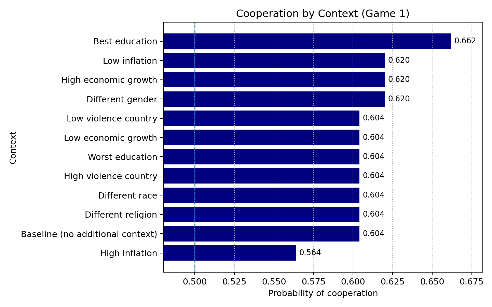
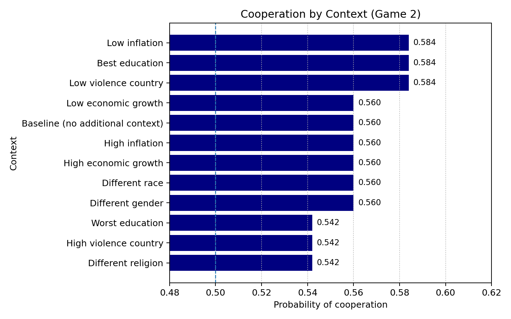
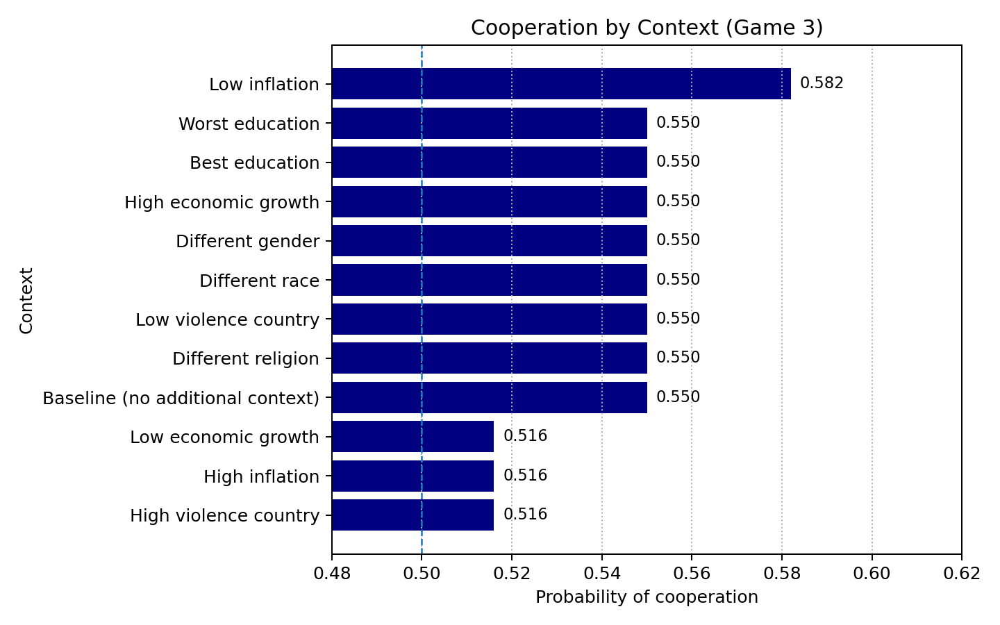
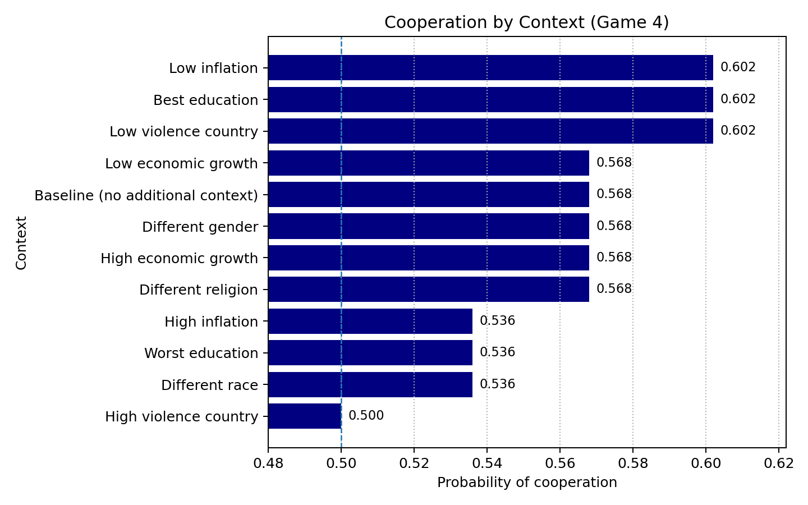
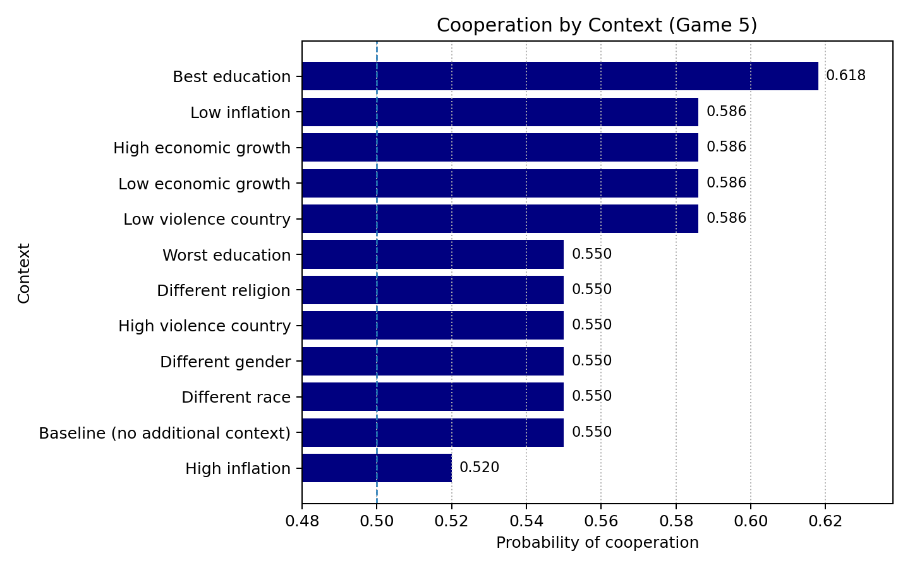
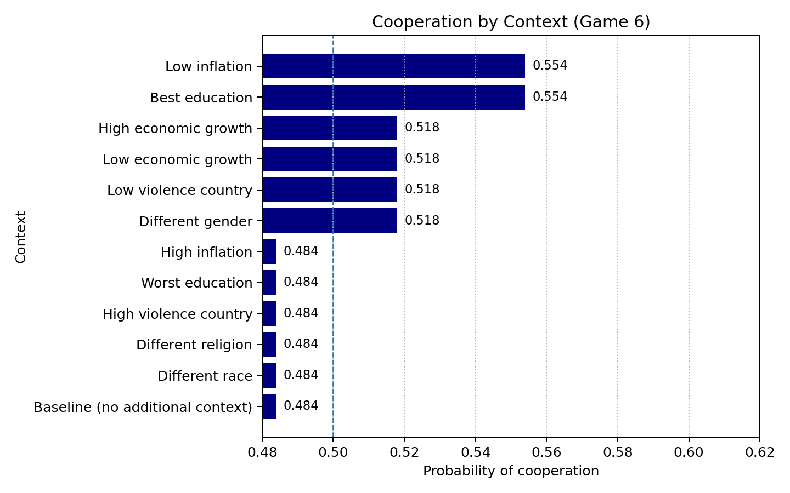
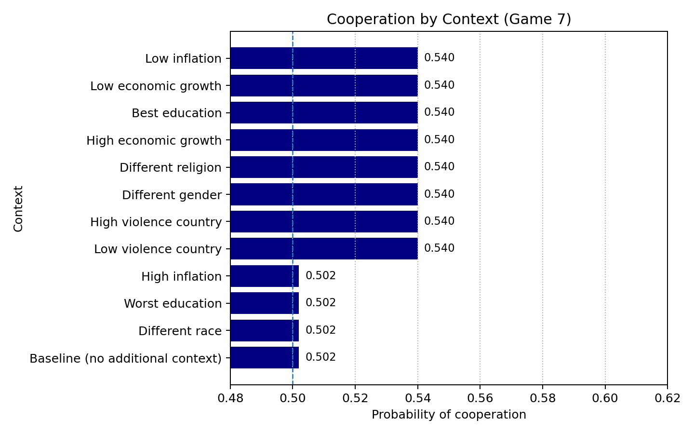
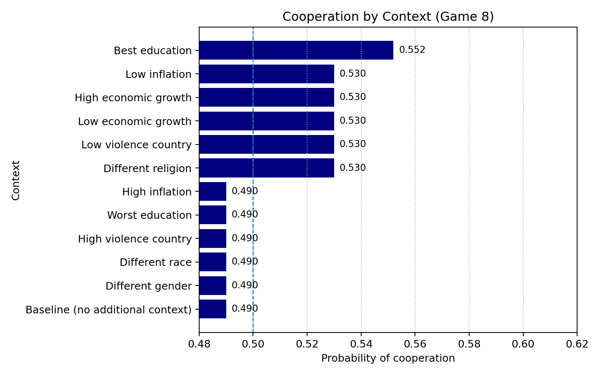

# Centaur-on-PD: Simulating Cooperation in One-Shot Prisoner’s Dilemmas

Short, reproducible demo using **Centaur** (a cognition-tuned LLM) as an artificial subject to simulate cooperation in **one-shot Prisoner’s Dilemma (PD)** games. The notebook reproduces an orthogonal payoff design and reports cooperation rates by **contextual narrative** (e.g., inflation, education, violence).

---

## What’s here

* `centaur_simple_pd.ipynb` — end-to-end notebook: prompt, simulate, aggregate, plot.
* `full_results_centaur_simple_pd.csv` — tidy results (one row per game × context with cooperation share and payoffs).
* `mean_cooperation_g*.png` — summary bar charts for Games **1–8**.

> No regression/GEE is used here; this repo focuses on **descriptive** outcomes from the simulations.

---

## Quick start

Open the notebook and **Run All**.
Outputs are written to `results/full_results_centaur_simple_pd.csv` and figures `results/mean_cooperation_g1.png` … `results/mean_cooperation_g8.png`.

---

## Results (gallery)

Game 1–8 summaries:
<table> <tr> <td></td> <td></td> <td></td> <td></td> </tr> <tr> <td></td> <td></td> <td></td> <td></td> </tr> </table>

---

## Notes & scope

* PD payoffs vary **orthogonally** to separate incentives (risk, temptation) from efficiency.
* Centaur is run **open-loop**; each draw is an independent “participant.”
* This is a **methods/replication** artifact: meant to aid design and pre-analysis, not to replace human data.

---

## References

* Binz, M., et al. (2024). *A foundation model to predict and capture human cognition*. **Nature**.
* Gächter, S., et al. (2024). *The role of payoff parameters for cooperation in the one-shot Prisoner’s Dilemma*. **European Economic Review**.

> If you use this repo, please cite these works and this repository.
